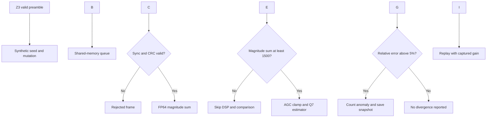

# NLOS Doppler RF DSP Fuzzing Engine

A C++ differential fuzzing prototype for a stateful RF DSP magnitude estimator. It combines **Z3-assisted valid-header generation, eight RF/protocol mutations, a shared-memory producer/consumer queue, AGC-aware fixed-point arithmetic, an FP64 reference, sanitizer instrumentation, and anomaly replay**.

The engineering result is a demonstrated reduction in reported numerical divergences through AGC hardening, approximation calibration, and exclusion of low-amplitude inputs from differential evaluation. The final supplied terminal run records **143,076 frames in 3,026 ms with zero reported semantic divergences**.


## Performance \& benchmarks

The table below follows actual execution summaries, correcting the earlier narrative that assigned 73,624 divergences to both the baseline and AGC-clamped runs.

|Recorded milestone|Pre-unconditional-clamp run|AGC clamped|Calibrated + 5% threshold|Final low-power gate|
|-|-:|-:|-:|-:|
|Frames consumed|131,527|143,257|140,945|**143,076**|
|Elapsed time|3,022 ms|3,022 ms|3,021 ms|**3,026 ms**|
|Reported divergences|98,370|73,624|1,212|**0**|
|Frames/s, using elapsed time|43,523|47,405|46,655|**47,282**|
|Nonzero coverage-map slots|252|258|256|**232**|
|Evidence|[Run 14](benchmarks/raw_logs/run-14.txt)|[Run 15](benchmarks/raw_logs/run-15.txt)|[Run 16](benchmarks/raw_logs/run-16.txt)|[Run 17](benchmarks/raw_logs/run-17.txt)|

**Throughput calculation:** `143076 / (3026 / 1000) = 47282.22 frames/s`. The previously quoted `47,692` comes from dividing by the nominal `3.000` seconds. Throughput counts all consumed frames, including invalid headers, invalid CRCs, and low-power frames; it does not measure only completed DSP comparisons. Timing starts after producer launch and includes consumer shutdown/drain, but excludes Z3 solving and shared-memory initialization.

The reduction from 73,624 to 1,212 is **98.35% in raw reported anomaly count**. Runs process different frame counts and change both implementation and oracle policy; this is not an isolated measurement of bug-detection accuracy.

!\[Historical recorded comparisons](benchmarks/plots/historical-comparison.png)

### What the divergence percentages actually show

|Figure|Evidence and interpretation|
|-|-|
|28.9033%|A displayed replay snapshot with initial gain 0.0294; not a campaign-wide maximum measurement.|
|10.2444%|A displayed AGC-clamped replay snapshot with initial gain 0.1000.|
|4.4818%|A displayed snapshot after recalibrating the replay executable against previously saved inputs. It is not the maximum error of the subsequent fuzz campaign.|
|12.8082%|A later low-power snapshot: golden magnitude sum 304.0559, target 343. This explains why the 4.4818% figure cannot be called a global peak.|
|5%|The final anomaly threshold. A zero count implies no evaluated frame exceeded it in that run; the engine does not emit a measured maximum. Equality at 5% would not be flagged.|

See [triage excerpts](benchmarks/raw_logs/), [all 17 historical summaries in CSV](benchmarks/historical_runs.csv), and [JSON with source lines and source checksum](benchmarks/historical_runs.json). The earliest runs use substantially different implementations and instrumentation and should not be treated as comparable speed benchmarks.

## What has been built

|Component|Implementation|What it accomplishes|
|-|-|-|
|Constraint-assisted seeding|`Z3ConcolicSolver` in `src/advanced\_engine.cpp`|Solves one 32-bit XOR preamble constraint to reach valid-header paths.|
|RF-domain mutations|`ConstellationDomainMutator`|Phase rotation, fading, bounded additive noise, sync corruption, carrier-frequency-offset-style rotation, clipping, payload-length mutation, CRC corruption.|
|Shared-memory queue|`SDRSharedMemoryStream`|Single producer/single consumer with acquire/release atomic indices; 1,024 slots, 1,023 usable.|
|Structural validation|`TargetDSPDecoder::ProcessFrame`|Sync check and CRC16 over all 32 IQ samples before numerical evaluation.|
|Stateful AGC|`ComputeEnergyWithAGC`|Gain updates by 0.85 or 1.05 and clamps to \[0.10, 2.00] on DSP-evaluated frames.|
|Differential oracle|Target fixed-point approximation vs `GoldenReferenceModel`|Flags relative discrepancies above 5% for golden magnitude sums at least 1,500.|
|Sanitizer support|`CMakeLists.txt`, `src/sancov\_hook.cpp`|ASan/UBSan and trace-PC coverage telemetry for the advanced executable.|
|Anomaly snapshots|`StateSnapshotFrame`, `CrashLogger`|Saves the input and pre-processing AGC state for the first 50 numerical anomalies per run.|
|Replay|`src/replay\_engine.cpp`|Recomputes target/reference values and prints per-snapshot divergence.|

The repo also contains an earlier AVX2 mutation kernel, striped mmap flight recorder, affinity helper, and toy RRC transition/pattern helpers under `include/`, plus an older harness in `src/main.cpp`. **The current CMake configuration builds only `advanced\_engine` and `replay\_engine`; those earlier components are not integrated into the advanced executable.** The pattern helper uses fixed weights, not a trained AI model.

## Runtime architecture




Coverage callbacks record instrumented execution independently of this decision flow. They do **not** feed back into corpus selection or mutation scheduling in the current implementation.

### Five engineering stages

<details>
<summary><b>Expand technical progression and implementation details</b></summary>

#### 1\. Constraint-assisted valid seeding

Z3 solves `sync\_word ^ 0xDEADBEEF == 0xCAFEBABE`, yielding `0x14530451`. This is a useful solver integration and valid-seed mechanism. It does not yet implement general concolic execution, path extraction, or iterative branch solving. A standalone equivalent lives in [solvers/z3\_preamble.py](solvers/z3_preamble.py).

#### 2\. Mutation and transport

A deterministic xorshift PRNG starts from `0x9E3779B97F4A7C15`. Every mutation starts from the same synthetic seed, rather than an evolving coverage-guided corpus. A named POSIX mmap region transports frames between two threads in one process. `Push` and `Pop` each copy a frame, so the implementation is not strictly zero-copy. An independently launched multi-process transport has not been demonstrated.

#### 3\. Stateful AGC hardening

The target computes a frame peak using `abs(I) + abs(Q)`. Peaks above 400 reduce gain by 15%; peaks below 100 increase it by 5%. Gain is then clamped to \[0.10, 2.00]. This constrains dynamic-range collapse during evaluated DSP calls. Low-power frames return before that call, so they do not update AGC state.

#### 4\. Fixed-point approximation calibration

For each processed sample, the implementation first rounds gain-scaled I and Q, then accumulates `122 \* max(abs(I), abs(Q)) + 51 \* min(abs(I), abs(Q))`. It applies `(+64) >> 7` once to the frame accumulation, divides by gain, and rounds again. The scale factor of 128 is essential: the coefficient numerator alone is not the magnitude estimate.

The golden model sums Euclidean magnitudes. Although named `ComputeEnergy`, this is **sum of magnitudes**, not conventional signal energy `sum(I² + Q²)` or calibrated RF power. Payload length zero means 32 samples; other lengths are capped at 32.

#### 5\. Oracle gating and replay evidence

The final implementation skips DSP evaluation for golden sums below 1,500 and flags evaluated frames only above 5% relative error. This suppresses quantization-dominated reports but also removes those inputs and their AGC transitions from test coverage. Replay retains input plus initial gain, allowing numerical inspection of selected anomalies. The final transcript demonstrates zero reported divergences under this policy, not verified sensitivity to injected regressions.

</details>

## Build and run

Use Linux, or an Ubuntu terminal under WSL2 on Windows. Native PowerShell/MSVC is not supported by the current POSIX implementation. Run one engine instance at a time because all instances use the same shared-memory name.

```bash
sudo apt-get update
sudo apt-get install -y build-essential cmake libz3-dev python3

git clone https://github.com/vinaypcv/NLOS-Doppler-RF-DSP-fuzzing-engine.git
cd NLOS-Doppler-RF-DSP-fuzzing-engine
cmake -S . -B build -DCMAKE\_CXX\_COMPILER=g++
cmake --build build --parallel
cd build
./advanced\_engine
./replay\_engine
```

GCC matches the current trace-PC hook configuration. The default advanced run lasts approximately three seconds plus shutdown/drain. It accepts no seed or duration arguments. Sanitizers and `-O2` are configured in CMake.

### Capture repeatable benchmark evidence

From the repository root:

```bash
bash benchmarks/run\_benchmark.sh 5
```

This builds the existing targets and runs five sequential campaigns in isolated output directories. Each campaign preserves stdout, stderr, exit status, parsed counters, elapsed-time throughput, and snapshots. The campaign manifest records the source commit, dirty state, CPU/platform, compiler, build cache and binary checksum. It produces an adjacent `.tar.gz` containing the captured evidence. Results vary with CPU, compiler, instrumentation and scheduling; 47.28k frames/s is historical evidence, not a guaranteed target.

The wrapper fails for nonzero engine exit, sanitizer diagnostics, missing summaries, or reported divergences. This is necessary because the original engine prints `PASS` and returns zero even when its divergence counter is nonzero.

### Standalone SMT demonstration

```bash
sudo apt-get install -y python3-z3
python3 solvers/z3\_preamble.py
```

Expected output: `0x14530451`. The C++ engine uses the Z3 development library; this optional Python script uses Python bindings.

## Outputs and how to read them

The final recorded terminal summary is:

```text
Execution Time             : 3026 ms
RF Frames Streamed (IPC)   : 143076
Sancov Coverage Traces Hit : 232 unique edges
Differential Divergences   : 0 semantic anomalies detected
Execution Status           : PASS
```

The `unique edges` wording is reproduced verbatim from the executable, but the hook hashes return addresses into 65,536 8-bit counters. Collisions and wraparound prevent interpreting it as an exact edge count or coverage percentage. A counter can wrap back to zero after repeated hits.

|Output|Meaning|
|-|-|
|Console summary|Time, all consumed frames, occupied coverage slots and divergence count.|
|`crashes/anomaly\_frame\_0.bin` … `49.bin`|Up to 50 semantic anomaly snapshots; these are not necessarily process crashes. Paths are relative to the run directory.|
|Replay table|Snapshot filename, initial gain, golden magnitude sum, target estimate and relative discrepancy.|
|Sanitizer stderr|Runtime diagnostics when ASan/UBSan detects a supported fault. Not a proof that all memory paths were tested.|
|Benchmark JSON and logs|New wrapper output with explicit status and provenance.|

To replay one captured anomaly, replace the path below with an existing snapshot:

```bash
./build/replay\_engine /absolute/path/to/anomaly\_frame\_0.bin
```

Without an argument replay reads `crashes/` in the current directory and shows at most 15 files, lexicographically sorted. Snapshots are raw native structs, without a portable versioned schema. Replay does not validate file length, sync, CRC or the low-power gate, and duplicates the target arithmetic; treat it as a numerical triage tool, not a complete regression verdict.

## Repository guide

|Path|Purpose|
|-|-|
|`src/advanced\_engine.cpp`|Current generator, queue, oracle and target implementation.|
|`src/replay\_engine.cpp`|Snapshot numerical triage.|
|`src/sancov\_hook.cpp`|Coverage-map callback.|
|`include/`, `src/main.cpp`|Earlier experimental components; not part of the current advanced target.|
|`benchmarks/raw\_logs/`|Extracted historical terminal summaries and selected triage evidence.|
|`benchmarks/historical\_runs.{json,csv}`|All extracted runs, source lines and calculated throughput.|
|`benchmarks/run\_benchmark.sh`|Build and capture new runs.|
|`benchmarks/plots/`|Historical comparison charts and their generation script.|
|`solvers/z3\_preamble.py`|Standalone constraint demonstration.|
|`docs/architecture.md`|Detailed architecture and limitations.|
|`docs/release-notes.md`|Evidence-focused release notes.|

## Limitations and next engineering milestones

1. **Measure oracle sensitivity.** Add deliberately faulty DSP variants and labeled cases; report detected faults, missed faults and false alarms separately. Zero alarms alone cannot establish correctness.
2. **Retain low-amplitude testing.** Evaluate the DSP on those frames and use justified absolute-plus-relative tolerances; report rejected, skipped and evaluated denominators and maximum errors separately.
3. **Correct instrumentation.** Use stable coverage IDs and non-wrapping occupancy, isolate target coverage, then connect coverage to corpus scheduling. Current counts also include harness paths.
4. **Harden arithmetic and IPC.** The CFO mutation subtracts 500 from an unsigned random value, causing wraparound instead of negative offsets. Check mmap/shm errors, correctly initialize mapped atomic objects, and support unique instance names and reliable shutdown.
5. **Make replay a regression tool.** Share target code, validate snapshot schemas, test malformed/truncated files, and return meaningful status codes.
6. **Expand RF validity.** Add parameterized sample rate, carrier frequency, delay/Doppler multipath models, longer IQ sequences, real captures and external/hardware targets. Current rotations and fading mutations alone do not validate NLOS receiver behavior.
7. **Establish release gates.** Automated tests, fixed-frame seeded runs, multiple seeds, longer campaigns, compiler matrix and repeatable sanitizer results are still needed before a production class.

